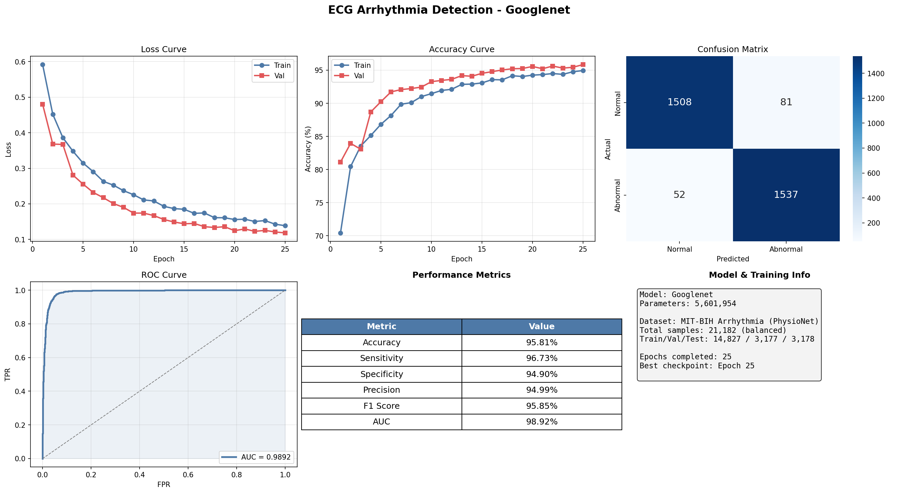

# Deep Learning-Based Arrhythmia Detection from ECG Signals 🫀


An end-to-end deep learning pipeline for the binary classification of cardiac arrhythmias (Normal vs. Abnormal) using standard 12-lead ECG signals. 

This project transforms 1D Electrocardiogram (ECG) time-series data into 2D time-frequency images (Scalograms) using the **Continuous Wavelet Transform (CWT)** with a Morlet wavelet. These rich visual representations are then classified using powerful Convolutional Neural Networks (CNNs).

<div align="center">
  
</div>

---

## 🚀 Key Features & Methodologies

1. **Automated Data Acquisition**: Automatically downloads and parses the widely recognized **MIT-BIH Arrhythmia Database** (48 records) from PhysioNet.
2. **Standardized Extraction**: Extracts individual heartbeats using a fixed 250-sample window around the R-peak (90 samples before, 160 after).
3. **Class Balancing**: Eliminates the heavy natural bias of normal heartbeats by applying 1:1 undersampling, resulting in a perfectly balanced dataset of **21,182 beats**.
4. **2D Scalogram Generation**: Converts 1D signals into `224x224` RGB images using 127 Morlet wavelet scales, processed via high-speed multiprocessing.
5. **Deep Learning Architectures**:
   - **SmallNet**: A custom, incredibly lightweight 21-layer CNN feature extractor (~3,700 parameters) designed for clinical edge-device deployment.
   - **GoogLeNet**: A massive pre-trained Inception-v1 network fine-tuned via Transfer Learning (~5.6M parameters) to serve as a high-accuracy clinical upper-bound.

---

## 📈 Performance Results

Evaluated on a completely unseen, stratified test set of **3,178 heartbeats** with strict class balance.

| Metric | GoogLeNet (25 Epochs) | SmallNet (12 Epochs) |
| :--- | :---: | :---: |
| **Accuracy** | **95.81%** | 75.77% |
| **Sensitivity (Recall)** | **96.73%** | 79.36% |
| **Specificity** | **94.90%** | 72.18% |
| **F1 Score** | **95.85%** | 76.61% |
| **ROC AUC** | **98.92%** | 82.41% |

*GoogLeNet achieved a highly clinically relevant Sensitivity rate, missing only 52 abnormal beats out of 1,589 total true abnormalities.*

---

## 📂 Project Structure

```text
BMI_Project/
├── data/                       # (Git-ignored) Raw MIT-BIH, processed CSVs, Scalogram PNGs
├── notebooks/                  
│   ├── colab_training.ipynb    # 1-Click Google Colab Automated GPU Training
│   └── 01_data_exploration...  # Exploratory data analysis
├── report/                     
│   └── ecg_arrhythmia_report.tex # Complete LaTeX Project Documentation
├── results/                    # Saved .pth weights, metrics, and generated PNG charts
├── src/                        # Core Pipeline Modules
│   ├── config.py               # Central hyperparameters and paths
│   ├── download_data.py        # Fetches MIT-BIH from PhysioNet
│   ├── extract_beats.py        # Slices 1D signals into individual beats
│   ├── build_scalograms.py     # CWT mathematical conversion to 2D images
│   ├── dataset.py              # PyTorch Dataloaders with Augmentation
│   ├── model.py                # SmallNet & GoogLeNet architectures
│   ├── train.py                # Main training loop
│   └── evaluate.py             # Inference testing script
├── generate_results.py         # Complete evaluation & dashboard generation tool
└── requirements.txt            # Python dependencies
```

---

## 💻 Installation & Setup (Local)

1. **Clone the repository:**
   ```bash
   git clone https://github.com/Revant-S/BMI_Project.git
   cd BMI_Project
   ```

2. **Install requirements:**
   ```bash
   pip install -r requirements.txt
   ```

3. **Run the Data Pipeline:**
   ```bash
   python -m src.download_data
   python -m src.extract_beats
   python -m src.build_scalograms --workers 4
   ```

4. **Train Models:**
   ```bash
   python -m src.train --model smallnet --epochs 25
   python -m src.train --model googlenet --epochs 25
   ```

5. **Evaluate & Generate Visual Dashboards:**
   ```bash
   python generate_results.py --model all
   ```

---

## ⚡ Google Colab (1-Click GPU Training)

Don't have a local GPU? We have built a fully automated Jupyter Notebook designed specifically to run this entire pipeline on Google Colab's Free T4 GPU.

**[Open the Automated GPU Training Notebook directly in Google Colab](https://colab.research.google.com/github/Revant-S/BMI_Project/blob/feature/2d-cnn-pipeline/notebooks/colab_training.ipynb)**

1. Click **Runtime -> Change runtime type** and select **T4 GPU**.
2. Click **Run All**.
3. The notebook will automatically download the data, generate the scalograms, train both models in minutes, and download the final `.pth` weights and `.png` dashboards directly to your computer!

---

## 👥 Contributors (National Institute of Technology, Tiruchirappalli)

* **Shagnik Sarkar** (110123102)
* **Revant Sinha** (110123088)
* **Satrajeet Paul** (110123100)
* **Mayank Das** (110123064)

*Project completed as part of the Biomedical Instrumentation curriculum.*
